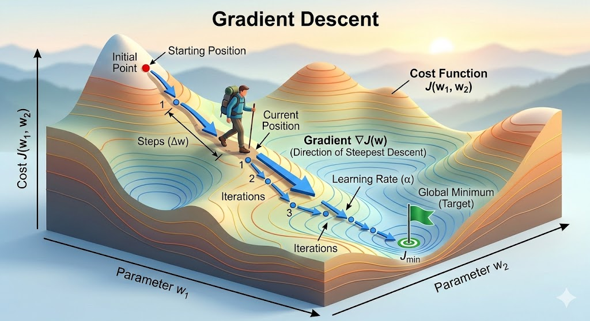

<!-- 
Blues/Greys: steelblue, royalblue, dodgerblue, slategray, darkslateblue.
Greens:      seagreen, forestgreen, olive, darkolivegreen.
Reds/Pinks:  crimson, indianred, firebrick, salmon.
Earth Tones: sienna, peru, chocolate, goldenrod. 
-->

# Foreword


It is a shame that we have only one semester to learn so much new knowledge but we don't have a real opportunity to really develop a meaningful and serious project.

:::{.callout-important}
You might feel "What the heck! The assignment is so long." Trust me bro! [**The solution for this project is much much shorter than the description itself. It is also mostly based on what you have done in Assignment 01.**]{style="color:red"} The long description is to help you to understand the project better and deeper. A short description will leave you pretty confused.
:::

## Reading this description

In order to understand the project better, the students are encouraged to read the description in the following order -- the `pdf` and `html` files are equivalent, and provided for each step:

1. Read the whole description once to get a general idea about the project. You don't have to understand everything in the first reading. Just try to get a general idea about the project. The files `01-description.html` (`.pdf`) are provided for this purpose. 
2. Read the implementation using **scikit-learn** in Python. This will give you the idea about how to use the two regression models in Python and what are the expected results. The C++ implementation will mimic the [**Python implementation interface**]{style="color:royalblue"}, so it is important to understand the Python implementation first. The files `02-sklearn-implementation.html` (`.pdf`) are provided for this purpose.
3. Read the mathematics behind the scene to understand the mathematical formulation of the two regression models and the gradient descent method. This will help you to understand how to implement the two regression models in C++. The files `03-maths.html` (`.pdf`) are provided for this purpose.
4. Read the demonstration of logistic regression in Python. This will give you a concrete example of how to implement the logistic regression model from scratch in Python. You can use this code as a reference for your C++ implementation. The code is not optimized for performance, but it is written in a way that is easy to understand and follow. The files `04-log-reg-demonstrations.html` (`.pdf`) are provided for this purpose.
5. Read the tutorial on how to build a header-only library to understand the concepts behind header-only library and to know how to implement the header-only library. The files `05-header-only-library.html` (`.pdf`) are provided for this purpose. 
6. Then, you should revisit the task description `01-description.qmd` to understand what you need to do for the assignment.


## Ultimate goal

In this assignment, we aim to build a mini-library that mimic two important machine learning frameworks in the machine learning world. In fact, they look ridiculously simple, they are one of the backbones of vast number of machine learning frameworks that have been used these days, including of course the genAI frameworks you are deploying. In the end of the assignment, we try to mimic two important classes provided in the celebrated library for machine learning: [**scikit-learn**](https://scikit-learn.org/stable/) (The text contains hyperlinks). Particularly, we focus on two regression models

- [**Linear Regression**]{style="color:red"}

  You already know how to implement it in C++ from Assignment 01. You just need to polish it and make it object-oriented.

- [**Logistic Regression**]{style="color:red"}
  
  You will learn how to implement it in C++ from scratch by following the Python implementation and the mathematical formulation given in the file `03-maths.html` and `03-maths.pdf`. 
  
  You will recognize that the mathematical formulation of the logistic regression model is slightly different from that of linear regression model, but the gradient descent iteration algorithm shares exactly the same formulation. For this reason, a large portion of what you have done for linear regression can easily carried over to logistic regression.

## Objectives
The two main objectives of this assignment consists of

1. Develop a mini-library `sklearn_lite` that mimic a small part of the Python library scikit-learn
2. Apply our built library to perform some fancy applications.

Besides these two main objectives, we take this opportunity to learn some knowledge that could be useful for you when you may choose [ENG4200](https://www.gla.ac.uk/coursecatalogue/course/?code=ENG4200) and [ENG5337](https://www.gla.ac.uk/coursecatalogue/course/?code=ENG5337)

# Quick tour to the world of machine learning

We will develop two classes `LinearRegression` and `LogisticRegression` representing two basic regression models "Linear Regression" and "Logistic Regression", respectively.

&#9998;&nbsp; [**Linear Regression**]{style="color:royalblue"} is used to make prediction on the continous spectrum of data points.

**Examples**

- Predict the house price of a given flat given its features such as total living area, number of bedrooms, distance to the city center, distance to schools, distance to public transporation stations, $\ldots$
- Predict the age of a person by using their recent photos.
- Predict the price of wine given its information: number of years, location, type of grape, $\ldots$
  
**Linear regression** can be easily extended to **Polynomial Regression** to enhance its power and widen its capability in various complex applications. 

&#9998;&nbsp; [**Logistic Regression**]{style="color:royalblue"} is used to classify data points into finite number of categories, such as $0, 1, 2, \ldots, K - 1$, for $K$-class classification.

**Examples**

- Given an image of one digit written by hand, predict which digit it represents. The image represent $1$ out of $10$ digits: $0, 1, 2, \ldots, 9$.
- Given a patient's record of ECG diagram, predict whether the patient is fine or not, i.e., just $0$ (not sick) or $1$ (sick).

## Terminologies

::: {.callout-important}
# Learn the Python interface first

It is important to understand the Python implementation of the two regression models before we can implement them in C++. The Python implementation will give you a clear idea about how to use the two regression models in Python and what are the expected results. The C++ implementation will mimic the Python implementation interface, so it is important to understand the Python implementation first. Please read the file `02-sklearn-implementation.html` to understand the Python implementation of the two regression models. You can also run the code in that file to see how the two regression models work in Python.
:::

Before going into the mathematics behind these two machine learning models, we need some terminologies. 

&#9998;&nbsp; [**Supervised Learning**]{style="color:crimson"}

Both of these regression methods are classified as **supervised learning** methods in which we have the input data given by $\mathbf{x}^{(i)} = (x_1^{(i)}, x_2^{(i)}, \ldots, x_n^{(i)})$ and output data given by $y^{(i)}$ for $i = 1, \ldots, m$, where $m$ is the number of samples.

&#9998;&nbsp; [**Dataset**]{style="color:crimson"}

Assume that we are given a dataset $\mathcal{D}$ with $m$ [**samples**]{style="color:royalblue"}, each sample has $n$ input [**features**]{style="color:royalblue"} $\mathbf{x}^{(i)}=(x_1^{(i)}, \ldots, x_n^{(i)}) \in \mathbb{R}^{n}$ and $m$ label $y^{(i)}$, where $i \in \{1, \ldots, m\}$ is an index of one sample. So the dataset $\mathcal{D}$ can be written as follows

$$
\mathcal{D} = \Big\{ \big( \mathbf{x}^{(1)}, y^{(1)} \big), \big( \mathbf{x}^{(2)}, y^{(2)} \big), \ldots, \big( \mathbf{x}^{(m)}, y^{(m)} \big) \Big\}
$$ {#eq-dataset}

&#9998;&nbsp; [**Regression Problem versus Classification Problem**]{style="color:crimson"}

- In the world of machine learning \& statistics, a [**regression problem**]{style="color:royalblue"} is a task where the goal is to predict a **continuous, numerical output value** based on one or more input variables (features).
- In a [**classification problem**]{style="color:royalblue"}, the goal is to predict a **discrete label** or **category** for a given input. Instead of calculating "how much" (like a price), you are determining "which one" (like a species or a status).

&#9998;&nbsp; [**Regression problem: Example**]{style="color:crimson"}

In [**regression problem**]{style="color:royalblue"} the label $y^{(i)}$ is a real number: $y^{(i)} \in \mathbb{R}$. An example is given in the dataset `concrete.csv`.

```{python}
#| label: load-concrete-dataset
import pandas as pd
concrete_data = pd.read_csv("./data/concrete.csv")
n_samples = len(concrete_data)
print(f"Number of samples = {n_samples}")   # the first row (headers of data) not counted
concrete_data.head()
```

In this dataset, we use $8$ input features are used to make prediction, that is $\mathbf{x}^{(i)} \in \mathbb{R}^{8}$. The label $y^{(i)}$ is a scalar (real) number, i.e. $y^{(i)} \in \mathbb{R}$.

&#10149;&nbsp; **Note** Do not confuse "_regression problem_" with "_linear regression_" model. Linear regression is a mathematical model, while regression problem refers to a class of problems of predicting contiuous outputs.

&#9998;&nbsp; [**Classification problem: Example**]{style="color:crimson"}

In [**classification problem**]{style="color:royalblue"} the label $y^{(i)}$ is an integral number (integer type) and it takes only finite number of values. If the problem involves classification of samples into $K$ categories, the value of $y^{(i)}$ can take only $K$ possibilities: $y^{(i)}\in \{0, \ldots K - 1\}$. Apparently, it does not matter how you set the value for $y^{(i)}$ as long as there are only $K$ possible values. However, it is conventional to start from $0$ and then increase by $1$. The mathematics stay the same; just formality of how you name things. An example is given in the dataset `ecg.csv`
```{python}
#| label: load-ecg-dataset
import numpy as np
data = np.loadtxt('./data/ecg.csv', delimiter=',')
X = data[:,:-1] # take all the rows, all the column from the first to the second last
y = data[:,-1]  # take all the rows, the last column
n_features = X.shape[1]
n_classes = len(np.unique(y))
print(f"n_features = {n_features}")
print(f"n_classes = {n_classes}")
```
As this is the ECG diagram, let us draw them and show the label as on the figure title as well.
```{python}
#| label: visualize-ecg-sample-images
import matplotlib.pyplot as plt
nrows, ncols = 3, 3
plt.figure(figsize=(9, 6))
np.random.seed(seed=42)         # just for reproducibility purpose
for i in range(nrows * ncols):
    plt.subplot(nrows, ncols, i+1)
    idx = np.random.randint(low=0, high=X.shape[0])
    plt.plot(data[idx])
    plt.title(f"label (y) = {int(y[idx])}")
    plt.xticks(np.linspace(0, 120, 5))
    plt.grid(True)
    
plt.tight_layout()
```

# Mathematics behind the scene

::: {.callout-important}
# Learn the mathematics behind the scene

It is important to understand the mathematics behind the scene before we can implement the two regression models in C++. You have already learned the mathematics behind linear regression in **Assignment 01**. We will revisit it and then proceed to logistic regression. You will quickly recognize that although the mathematical formulation behind the logistic regression model is slightly different from that of linear regression model, the gradient descent iteration algorithm shares exactly the same formulation. For this reason, a large portion of what you have done for linear regression can easily carried over to logistic regression.
:::


Since we want to implement these models in C++ from scratch, we need to understand the mathematics behind the scene. This is the topic of this Section. Note that you have learned the maths behind `LinearRegression` in the **Assignment 01**. We shall revisit it and proceed to logistic regression.

You will quickly recognize that although the mathematical formulation behind the logistic regression model is slightly different from that of linear regression model, the gradient descent iteration algorithm shares exactly the same formulation. For this reason, a large portion of what you have done for linear regression can easily carried over to logistic regression.

## Building and training a machine learning model {#sec-build-and-train-ml-model}

You have heard a lot about the Machine Learning and all the hype about it. In my view^[I have taught "Intro to Machine Learning (ML) \& Artificial Intelligence (AI) 4" (**ENG4200**) and "Advanced ML and AI 5" (**ENG5337**) in the last three academic years], building and training a machine learning model needs $3$ key components:

1. [**Build or define a model**]{style="color:crimson"}
   
   This step involves how we define a mapping from one space to another space. This mapping depends on a set of parameters which is called [**learnable parameters**]{style="color:blue"} or [**model parameters**]{style="color:blue"}.
2. [**Define how we measure the model**]{style="color:crimson"}

    To train the model or to learn the right parameters, we need a way to measure how well the model performs in relative with the given dataset. In this step, we define a loss function which measures how well the model make predictions. We define the loss function so that it serves the following intuition. [The smaller the loss function is, the better the model can make good predictions. The larger the loss function is, the worse the model can make good predictions. For this reason, we want to minimize the loss function by looking for the right parameters.]{style="color:blue"}
3. [**Train the model**]{style="color:crimson"} 
   
   To train a model is to look for the model parameters so that the loss function becomes smaller and smaller, leading to a minimization problem. To solve this minimization problem, we need a gradient-based method and there are many such gradient-based methods. 


## Gradient descent method {#sec-gradient-descent-method}

Imagine that the graph of a loss function 
$$
\mathcal{L} = \mathcal{L}(\Theta) = \mathcal{L}(\theta_1, \ldots, \theta_n),\quad \Theta \in \mathbb{R}^{n}
$$
can be visualized as a valley and the minimum occurs at the bottom of the valley. Starting from a particular position on the valley, we try to walk all the way down to the bottom. At one single position, we want to make a step so that we can actually walk down. Mathematically, one can prove that the gradient of the loss function $\nabla \mathcal{L}$ is the direction we can walk down the fastest.^[If you are interested in how this is proved, please feel free to ask me.] For this reason, the gradient descent method was invented to minimize the loss function $\mathcal{L} = \mathcal{L}(\Theta)$.



Now, we want to minimize the loss function $\mathcal{L} = \mathcal{L}(\Theta)$ following the intuition presented in the above illustration figure. Assume that we start initially at the position $\Theta^{[0]}$. The aim is to compute $\Theta^{[1]}$ so that the loss function at $\Theta^{[1]}$ is smaller than the loss function evaluated at $\Theta^{[0]}$. This can be done by using the following update formula:
$$
\Theta^{[1]} := \Theta^{[0]} - \alpha \nabla \mathcal{L}(\Theta^{[0]}),
$$
where $\nabla\mathcal{L}(\Theta^{[0]}) \in \mathbb{R}^{n}$ is the gradient of the loss function $\mathcal{L}$ evaluated at $\Theta^{[0]}$ and $\alpha \in \mathbb{R}$ is the learning rate (just a scalar) dictating how far we step in the direction $\nabla \mathcal{L}(\Theta^{[0]})$. 

It turns out that the next step to walk as a human in the figure follows exactly the same strategy. Therefore, it leads to the iteration process
$$
\Theta^{[t+1]} := \Theta^{[t]} - \alpha \nabla \mathcal{L}(\Theta^{[t]}),\quad \forall t= 0, 1, 2, \ldots
$${#eq-gradient-descent-update-formula}
@eq-gradient-descent-update-formula is written in the vector form and can be rewritten in the unpacked form as follows
$$
\begin{aligned}
\theta_{1}^{[t+1]} &:= \theta_{1}^{[t]} - \alpha \frac{\partial \mathcal{L}}{\partial \theta_{1}}(\theta_1^{[t]}, \ldots, \theta_{2}^{[t]}), \\[3pt]
\theta_{2}^{[t+1]} &:= \theta_{2}^{[t]} - \alpha \frac{\partial \mathcal{L}}{\partial \theta_{1}}(\theta_1^{[t]}, \ldots, \theta_{2}^{[t]}), \\[3pt]
& \text{etc.} \\[3pt]
\theta_{n}^{[t+1]} &:= \theta_{n}^{[t]} - \alpha \frac{\partial \mathcal{L}}{\partial \theta_{1}}(\theta_1^{[t]}, \ldots, \theta_{n}^{[t]}). \\[3pt]
\end{aligned}
$$

This is the key algorithm we need to implement for our project assignment.


# Task

You need to design a header-only library that is implemented in an Object-oriented Programming fashion so that it mimics the **scikit-learn** library in Python. Particularly, the following are the must-do:

## Basic tasks {#sec-bare-minimum-task}

1. Decide your own OOP design to implement the library and program in general. The design involves how you want to organize classes, inheritence, choices of data types and data storage. **Note** that a functioning program is not necessary a well-designed programe. You need to make your own decision. 
   
   Try to function as a software engineer 😏😏!!!
2. Build two classes `LinearRegression` and `LogisticRegression` that mimic their counterparts in Python. These classes must have two important member functions `fit()` and `predict()` with appropriate function parameters.
3. Decide on how you want to read the `.csv` file. Using either procedural programming or object-oriented programming is fine. Make sure you explain briefly how you read the `.csv` file in the comments of your code. You can use any library to read the `.csv` file, but you need to explain how you read the `.csv` file in the comments of your code. You can also write your own code to read the `.csv` file if you want to.
4. Add these two classes into the namespace `linear_model`. This `linear_model` is again a namespace inside a bigger namespace `sklearn_cpp`. This step is to mimic the important   statement in Python. As you can see, the `linear_model` is a submodule of the module `sklearn`.
   
    ```{.python} 
    from sklearn.linear_model import LinearRegression
    from sklearn.linear_model import LogisticRegression
    ```

5. Write a main program to apply these two classes to solve two problems:
    - Predict concrete strength using linear regression -- just like example in Python
    - Predict whether a patient is fine or not given an ECG data -- just like example in Python

## Build the **header-only** library

1. Based on the code you have achieved in @sec-bare-minimum-task, build **header-only** library by following my provided example. This is a fantastic **header-only** library that you can look at: [xtensor](https://github.com/xtensor-stack/xtensor). All the header files can be found at [header file source code](https://github.com/xtensor-stack/xtensor/tree/master/include/xtensor).
2. Write a main program that use the **header-only** library you have just built to test whether the library works.


## Applications

You need to use your code to solve three problems in the main function. These three problems are given in the file `02-sklearn-implementation.html` and `02-sklearn-implementation.pdf`. The three problems are as follows:

1. Predict concrete strength using linear regression -- just like example in Python
2. Predict whether a patient is fine or not given an ECG data -- just like example in Python
3. Predict the digit written by hand given the image of the digit. This is a more challenging problem. 
   You can also use the code in `generate_mnist_csv.py` to generate your own `mnist_micro.csv` file if you want to. You can use the dataset `mnist_micro.csv` or `mnist_mini.csv` for this problem. 

:::{.callout-note}
# Focus on the implementation and reasonable performance
This is not a Machine Learning course, so the focus is not on the performance of the two regression models. The focus is on how to implement the two regression models in C++ in an Object-oriented Programming fashion. You don't have to beat the accuracy of the two regression models provided in Python code. You just need to make sure that your implementation is correct and can make good predictions on the given datasets. 

The accuracy of the two regression models can be improved by tuning the hyperparameters such as learning rate, number of iterations, regularization strength, etc. However, you don't have to tune these hyperparameters to achieve good performance. You just need to make sure that your implementation is correct and can make good predictions on the same training dataset as the Python code.
:::

::: {.callout-note}
# Ask me if you have any questions
Please feel free to ask me via email or in person if you have any questions about the assignment. Unfortunately, I cannot provide you with the solution code or my opinion on how to implement the code. I can only explain the mathematics behind the scene and the requirements of the assignment.
:::

# Marking scheme


1. Basic tasks: 80/100
   - Good OOP program design: 15/100
   - Build two classes and test them correctly: 40/100
   - Main program to apply the two built classes to two applications: 15/100
2. Build the header-only library: 10/100
3. Comments and documentation: 20/100
  
    There will be no report for this assignment. You just need to write comments in your code to explain how you implement the code and how you read the `.csv` file. The comments should be clear and concise. The code should be well-organized and easy to read. The code should be well-documented with comments explaining the purpose of each function and class, as well as any important details about the implementation.


