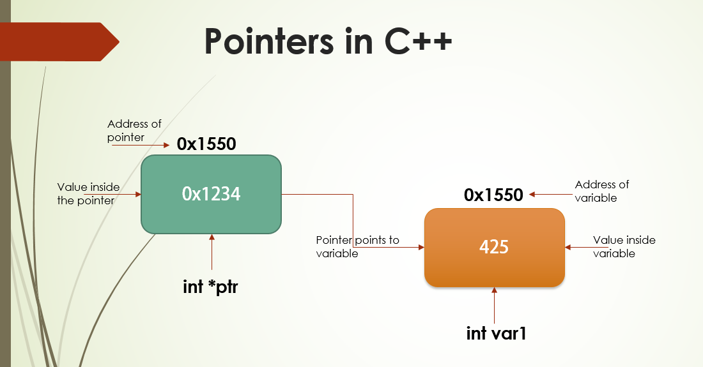
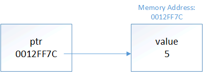
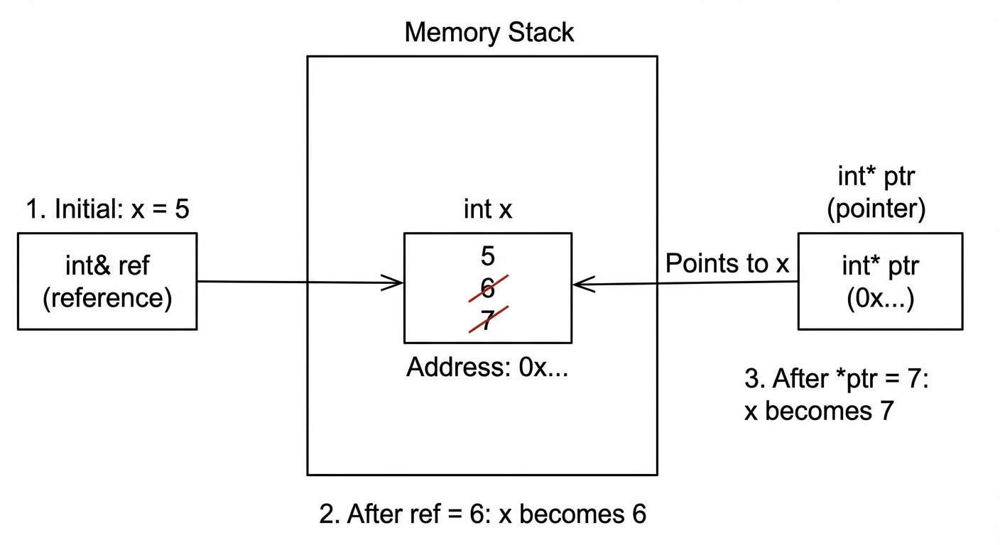

# Introduction to pointers

## Memory and address

&#10149;&nbsp; Consider a normal variable like this:
```{.cpp}
int x { 425 };
```

**Behind the scene**

::: {.incremental}
- When this code is executed, [a piece of memory from RAM will be assigned to this object]{style="color:navy"}.
- The variable `x` is (hypothetically, see the figure before) assigned memory address `0x1234`.
- Whenever we use the variable `x`, the program will go to the memory `0x1234` to access the value stored there.
:::

::: {.fragment}
&#10149;&nbsp; This is also true with references:
```{.cpp}
int main()
{
    int x { 42 };
    int& ref { x };
    std::cout << "x = " << x << ", ref = " << ref << '\n';
    return 0;
}
```

&#10140;&nbsp; Whenever we use `ref`, the program will go to the memory address of the variable `x` (hypothetically address = `0x1234`) to access the value.
:::


## The address-of operator (&): The ampersand character

&#10149;&nbsp; The [**address-of operator (&)**]{style="color:red"} returns the memory of address of its operand.

::: {#lst-address-of-operator lst-cap="We can retrieve the address of a variable by using the address-of operator, the ampersand character &. Filename=`address_of_operator_example.cpp`"}
```{.cpp}

```
:::

&#10149;&nbsp; Let us run this code snippet.

::: {.fragment}
- Memory addresses are typically printed as hexadecimal values.
- For objects that use more than one byte of memory, address-of will return the memory address of the first byte used by the object.
:::

## The dereference operator (*): The asterisk character

&#10149;&nbsp; The [**dereference operator (*)**]{style="color:red"} (also occasionally called the [**indirection operator**]{style="color:red"}) returns the value at a given memory address as an lvalue.

::: {#lst-address-of-operator lst-cap="Dereference operator returns the value at a given memory address. Filename=`dereference_operator_example.cpp`"}
```{.cpp}

```
:::

&#10149;&nbsp; Let us run this code snippet.

## Address-of and dereference operators: Some points to note

::: {.my-box}
**Key insight**

The [_address-of operator_]{style="color:red"} (&) and [_dereference operator_]{style="color:blue"} (*) work as opposites: address-of gets the address of an object, and dereference gets the object at an address. 
:::


::: {.fragment}
**Regarding the ampersand**

The [`&`]{style="color:red"} may cause confusion because it has different meanings depending on context:

- When following a type name, `&` denotes an lvalue reference: 

    &#10140;&nbsp; `int& ref`.
- When used in a unary context in an expression, `&` is the address-of operator:
  
    &#10140;&nbsp; `std::cout << &x`.
- When used in a binary context in an expression, `&` is the Bitwise AND operator:
  
    &#10140;&nbsp; `std::cout << x & y`.
:::

# Pointers

[_A pointer is an object that holds a memory address (typically of another variable) as its value._]{style="color:navy"} 

## Pointers

A [**pointer**]{style="color:red"} [<u>is an object</u>]{style="color:navy"} that holds a memory address (typically of another variable) as its value.

&#10149;&nbsp; A type that specifies a pointer is called a [**pointer type**]{style="color:red"}.

&#10149;&nbsp; Pointer types are declared using an asterisk (*).

```{.cpp}
double;     // a normal double
double&;    // an lvalue reference to a double value
double*;    // a pointer to an double value (holds the address of a double value)
```

## Pointers: Example

::: {#lst-pointer-example lst-cap="An example of using pointers, address-of operator and dereference operator. Filename=`pointer_example.cpp`"}
```{.cpp}

```
::: 
&#10149;&nbsp; Let us run this code snippet. 

[**Question**]{style="color:navy"}: What would you expect to see?

**Note**: The asterisk is part of the declaration syntax for pointers, not the use of dereference.

## Pointers: Declare multiple pointers in one line

We generally should not declare multiple variables on a single line. 

If we do, the asterisk has to be included with each variable.

```{.cpp}
int* ptr1, ptr2;    // incorrect: ptr1 is a pointer to an int, 
                    // but ptr2 is just a plain int!
int* ptr3, * ptr4;  // correct: ptr3 and ptr4 are both pointers to an int
```

## Pointers: Demonstration


# Pointer initialization

A pointer that has not been initialized is sometimes called a [**wild pointer**]{style="color:red"}.

Always initialize your pointers.

## Pointer initialization

- A pointer that has not been initialized is sometimes called a [**wild pointer**]{style="color:red"}.
- Wild pointers contain garbage address.
- Dereferencing a wild pointer will result in undefined behavior (pretty much like using uninitialized variables)

::: {.my-box}
**Best practice**

Always initialize your pointers.
:::


::: {.fragment}
::: {#lst-initialize-pointers lst-cap="Best practice: Always initialize pointers. Filename=`initialize_pointers.cpp`"}
```{.cpp}

```
:::
:::

## Pointer initialization

&#10149;&nbsp; Since pointers hold addresses, when we initialize or assign a value to a pointer, that value has to be an address -- Just common sense.

::: {.fragment}
::: {#lst-initialize-pointers-using-addresses lst-cap="Initialize pointers using addresses. Filename=`initialize_pointers_using_addresses.cpp`"}
```{.cpp}

```
:::
:::

## Pointer initialization: Demonstration



This is where **pointers** get their name from:

- `ptr` is holding address of `x`.
- `ptr` is **pointing to** `x`.

# Pointers and Assignment

Because pointers are objects, we can perform assignment on them.

## Pointers and assignment

Use assignment with pointers in two ways:

- To change what the pointer is pointing at: Assign the pointer a new address.
- To change the value being pointed at: Assign the _dereferenced_ pointer a new value

::: {#lst-assign-pointer-to-new-address lst-cap="Assign a pointer to a new address. Filename=`assign_pointer_to_new_address.cpp`"}
```{.cpp}

```
:::
&#10149;&nbsp; Let us run this code snippet. [**Question**]{style="color:navy"} Write code to change the value of `x` to `24` via using `ptr`.


## Pointers and assignment

::: {#lst-change-value-using-dereference lst-cap="Change value of variable via dereferencing a pointer. Filename=`change_value_using_dereference.cpp`"}
```{.cpp}

```
:::

## Pointers and assignment: Key insight

:::{.my-box}
**Key insight**

- When we use a pointer without a dereference (`ptr`), we are accessing the address held by the pointer. Modifying this (`ptr = &y;`) changes what the pointer is pointing at.

- When we dereference a pointer (`*ptr`), we are accessing the object being pointed at. Modifying this (`*ptr = 6;`) changes the value of the object being pointed at.
:::

At this point, you should already feel:

[Pointers behave much like lvalue references]{style="color:navy"}

## Pointers behave much like lvalue reference

Important to note: [pointer is not lvalue reference]{style="color:navy"}. But we can write code like this:

::: {#lst-pointers-behave-much-like-references lst-cap="Pointers behave much like lvalue references. But they are not the same. Filename=`pointers_behave_like_references.cpp`"}
```{.cpp}

```
:::

&#10149;

## Pointers behave much like lvalue reference: Figure demonstration



## But references are not pointers

There are some other differences between pointers:

| References | Pointers |
|:------|:---------|
| must be initialized | not required to be initialized |
| are not objects | are objects |
| cannot be reseated | can change what they are pointing at |
| must always be bound to an object | can point to nothing (null pointer)|
| "safe" (outside of dangling reference) | are inherently dangerous (we'll discuss in the next lesson) | 

# The address-of operator returns a pointer


## The address-of operator returns a pointer

- The address-of operator _does not_ return the address of its operand _as a literal_.
- [It returns a pointer]{style="color:navy"} to the operand (whose value is the address of the operand).

&#10149;&nbsp; **Example**: Given variable `int x`, `&x` returns an `int*` holding the address of `x`.

::: {#lst-address-of-returns-pointer lst-cap="The address-of operator does not return the address of its operand as a literal. It returns a pointer to the operand. Filename=`address_of_returns_pointer.cpp`"}
```{.cpp}

```
:::

&#10149;&nbsp; Let us run this code snippet. [**Question**]{style="color:navy"}: What do you think about the size of pointers?


## The size of pointers

The size of a pointer is dependent upon the architecture the executable is compiled for:

- a pointer on a 32-bit machine is 32 bits (4 bytes)
- a pointer on a 64-bit machine is 64 bits (8 bytes)

This is true regardless of the size of the object being pointed to. 

&#10140;&nbsp; This is just common sense: [A pointer is just a memory address, and the number of bits needed to access a memory address is constant.]{style="color:navy"}

## The size of pointers

::: {#lst-size-of-pointer lst-cap="Size of pointers depends on the architecture the executable is compiled for. Filename=`size_of_pointers.cpp`"}
```{.cpp}

```
:::

&#10149;&nbsp; Let us run this code snippet.

