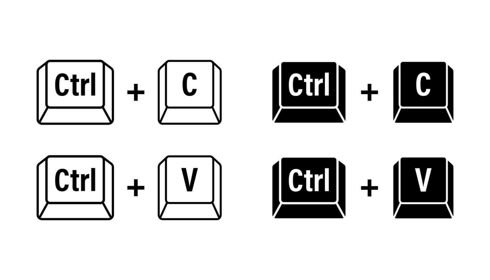

# Intro to inheritance

## Intro to inheritance: Shapes
You want to build a software drawing various **2D Shapes**: Rectangle, Square, Polygon, Circle, Ellipse, etc.

::: {.fragment}
- You can decide to build each class representing each particular shape. But you recognize "Wait a minute":

  - A `Square` [is a]{style="color:red"} `Rectangle`
  - A `Rectangle` [is a]{style="color:red"} `Polygon`
  - A `Circle` [is a]{style="color:red"} `ELlipse`
  - All of them is a `Shape`
  
- Furthore, we notice
  - A `Polygon` [has a]{style="color:red"} list of `Point2D`
  - A `Ellipse` [has a]{style="color:red"} center of `Point2D` and [has two]{style="color:red"} two axis sizes `a` and `b` of type `double`.
  - A `Circle` is similiar to `Ellipse` but `a == b`.
  - A `Rectangle` [has a]{style="color:red"} has a corner of `Point2D` and two sizes `a` and `b` of type `double`
  - A `Square` is similar to a `Rectangle` but `a == b`.
:::

## Intro to inheritance: Shapes

- You notice that

  - Drawing a square should be a consequence of drawing a rectangle with the same size.
  - Drawing a rectangle should be a consequence of drawing a "special" polygon of 4 sides.
  - Drawing a circle should be a consequence of drawing an ellipse

So why do we bother to build different classes separately!

## Hierarchies

A hierarchy is a diagram showing how various objects are related.


## Intro to inheritance: University People

If the above example cannot convince you enough, look at our University hierarchy.

:::{.fragment}
**A very small description about roles in our Uni**

- Every member of staffs [has a]{style="color:red"} `name`, a `birthday`, an `ID`
- Every student [has a]{style="color:red"} `name`, a `birthday`, an `ID`
- There are different types of staff members: `Lecturer`, `TOMember`, `Demonstrator`, `SecurityGuard`
- There are different types of students: `UGStudent` (undergraduate), `PGTStudent` (Post-graduate Taught) and `PGRStudent` (Post-graduate Research)
- Every person in the Uni has their role and knows their role, work on their role.
:::

:::{.fragment}
&#10149;&nbsp; If you are about to create all the classes `Lecturer`, `TOMember`, `Demonstrator`, `SecurityGuard`, `UGStudent`, `PGTStudent`, `PGRStudent`, you see that you must [*plug figure here*] a lot for common data members and member functions.


{width=30%}

:::


::: {.fragment}
This violates the principle designing rule: [**Do not repeat yourself**]{style="color:red"}
:::

## Intro to inheritance: How about the following design hierarchy

```{mermaid}
%%| echo: false
classDiagram
    direction TD
    %% Person is an abstract base class
    class Person {
        <<Abstract>>
        -name: String
        -birthday: Date
        -ID: Integer
        +knowRole() String
    }

    %% StaffMember inherits from Person
    class StaffMember {
        <<Abstract>>
        +workOnRole() 
    }
    Person <|-- StaffMember : inherits from

    %% Specific Staff Roles
    class Lecturer {
        +teach() 
        +mark() 
    }
    class TOMember {
        +organizeTimeTable() 
        +processGrades() 
    }
    class Demonstrator {
        +assist() 
        +provideFB() 
    }
    class SecurityGuard {
        +assist() 
        +checkSafety() 
    }

    StaffMember <|-- Lecturer : implements
    StaffMember <|-- TOMember : implements
    StaffMember <|-- Demonstrator : implements
    StaffMember <|-- SecurityGuard : implements

    %% Student inherits from Person
    class Student {
        <<Abstract>>
        +workOnRole() 
    }
    Person <|-- Student : inherits from

    %% Specific Student Roles
    class UGStudent {
        +writeBScThesis()
    }
    class PGTStudent {
        +writeMScThesis()
    }
    class PGRStudent {
        +writePhDTHesis()
    }

    Student <|-- UGStudent : implements
    Student <|-- PGTStudent : implements
    Student <|-- PGRStudent : implements

    %% Styling (Optional but helpful)
    style Person fill:#f9f,stroke:#333,stroke-width:2px
    style StaffMember fill:#bbf,stroke:#333
    style Student fill:#bfb,stroke:#333
    style Lecturer fill:#ddd,stroke:#333
    style UGStudent fill:#ddd,stroke:#333
```

# Basic inheritance in C++

## Terminilogies


## Terminilogy

&#9998;&nbsp; In an inheritance (is-a) relationship

- the class being inherited from: [**parent class**]{style="color:red"}, [**base class**]{style="color:red"}, or [**superclass**]{style="color:red"}
- the class doing the inheriting: [**derived class**]{style="color:red"}, [**derived class**]{style="color:red"}, or [**subclass**]{style="color:red"}


## Basic inheritance in C++: Mini example

&#10149;&nbsp; We will adopt a smaller design structure:

- Every `Lecturer` [is a]{style="color:red"} a `UniPerson`
- Every `Student` [is a]{style="color:red"} a `UniPerson`
- Every `Lecturer` and `Student` has `name` and `ID`.

We shall discuss 
- `work_on_role()` later when we study [**Polymorphism**]{style="color:red"} and [**Virtual Function**]{style="color:red"}.
- other member functions in `Lecturer` and `Student` when we study [_adding more functionality_] to derived class.


## Basic inheritance in C++: Mini-diagram for code demonstration
```{mermaid}
%%| echo: false
classDiagram
    direction LR
    %% Person is an abstract base class
    class UniPerson {
        -name std::string
        -ID int
        -age int
        +get_name() std::string 
        +get_ID() int
        +get_age() int
    }
    %% class UniPerson
    %% UniPerson : -name string
    %% UniPerson : -ID int
    %% UniPerson : -age int

  

    %% Specific Staff Roles
    class Lecturer {
        - salary: double
        + get_salary() double
    }

    UniPerson <|-- Lecturer : inherits from

    %% Student inherits from Person
    class Student {
        -tuition_fee: double
        +get_tuition() double
    }
    UniPerson <|-- Student : inherits from


    %% Styling (Optional but helpful)
    %% style Person fill:#f9f,stroke:#333,stroke-width:2px
    %% style Student fill:#bfb,stroke:#333
    %% style Lecturer fill:#ddd,stroke:#333
```

## Implementation of Inheritance: class `UniPerson`

&#10149;&nbsp; Let us look at the class `UniPerson`

::: {#lst-class-uni-person lst-cap="class `UniPerson`. Filename=`uniperson.cpp`"}
```{.cpp}

```
:::

## Implementation of Inheritance: class `Lecturer` without inheritance

::: {#lst-class-lecturer-without-inheritance lst-cap="class `Lecturer` without inheritance. Filename=`lecturer_noinheritance.cpp`"}
```{.cpp}

```
:::

&#10149;&nbsp; **Question** Can you tell me what problem we have?

## Implementation: class `Lecturer` inherited from class `UniPerson`

::: {#lst-class-lecturer-with-inheritance lst-cap="class `Lecturer` inherited from class `UniPerson`. Filename=`lecturer.h`"}
```{.cpp}

```
:::

## Impelemntation: Put two classes together into a `main` program


::: {#lst-main-uniperson-lecturer lst-cap="A program using class `Lecturer` derived from the class `UniPerson` Filename=`main_uniperson_lecturer.cpp`"}
```{.cpp}

```
:::

&#10149;&nbsp; **Notice** that we can access `age`, `id` members although we did not define them explicitly in class `Lecturer`. _Let us run the code._

## Implementation: class `Student`

&#10149;&nbsp; It is now easy to write class `Student` derived from `UniPerson`

::: {#lst-class-student lst-cap="class `Student` inherited from the class `UniPerson` Filename=`student.h`"}
```{.cpp}

```
:::

## Implementation: Put three classes together into a `main` program


::: {#lst-main-uniperson-lecturer-student lst-cap="A program using classes `Lecturer` and `Student` derived from the class `UniPerson` Filename=`main_uniperson_lecturer_student.cpp`"}
```{.cpp}

```
:::

## Inheritance chains

&#9998;&nbsp; We can comeback to our bigger diagram

`UGStudent`, `PGTStudent` and `PGRStudent` are all derived from class `Student` and thus we have [**inherintance chain**]{style="color:red"}

```{mermaid}
%%| echo: false
classDiagram
    %% Person is an abstract base class
    class UniPerson {
    }
    class Lecturer {
    }
    class Student {
    }
    UniPerson <|-- Student : inherits from
    class PGTStudent {
    }
    class UGStudent {
    }

    UniPerson <|-- Lecturer : inherits from
    Student <|-- UGStudent: inherits from
    Student <|-- PGTStudent: inherits from
    Student <|-- PGRStudent: inherits from
    %% Styling (Optional but helpful)
    style UniPerson fill:#f9f,stroke:#333,stroke-width:2px
    style Student fill:#bfb,stroke:#333
    style Lecturer fill:#ddd,stroke:#333
```

&#10149;&nbsp; We will write a class for `UGStudent`. 

&#10149;&nbsp; Instead of writing everything all the classes in one single giant filet, let us do this in multiple header files, which is the next topic.

# Split the program into header files and implementation files

## Goals of this example

:::{.fragment}
&#9998;&nbsp; We go through the steps that need to be done to build a program that needs implementation of many classes.

- Write header files (`filename.h` or `filename.hpp`) for each class
- Write implementation files (`filename.cpp`) for the corresponding class
- Compile the main program using the `.cpp` files.
:::

::: {.fragment}
We build four classes and one main program. Each class is done by one header file `.h` and one implementation file `.cpp`:

- class `UniPerson`
- class `Lecturer` inherits from `UniPerson`
- class `Student` inherits from `UniPerson`
- class `UGStudent` inherits from `Student`
:::

## class `UniPerson`: Header file

::: {#lst-header-file-uniperson lst-cap="Header file for class `UniPerson` Filename=`uni-program/uniperson.h`"}
```{.cpp}

```
:::

## class `UniPerson`: Implementation file

::: {#lst-implementation-file-uniperson lst-cap="Implementation file for class `UniPerson` Filename=`uni-program/uniperson.cpp`"}
```{.cpp}

```
:::

## class `Lecturer`: Header file

::: {#lst-header-file-lecturer lst-cap="Header file for class `Lecturer` Filename=`uni-program/lecturer.h`"}
```{.cpp}

```
:::

## class `Lecturer`: Implementation file

::: {#lst-implementation-file-lecturer lst-cap="Implementation file for class `Lecturer` Filename=`uni-program/lecturer.cpp`"}
```{.cpp}

```
:::

## class `Student`: Header file

::: {#lst-header-file-student lst-cap="Header file for class `Student` Filename=`uni-program/student.h`"}
```{.cpp}

```
:::

## class `Student`: Implementation file

::: {#lst-implementation-file-student lst-cap="Implementation file for class `Student` Filename=`uni-program/student.cpp`"}
```{.cpp}

```
:::

## class `UGStudent`: Header file

::: {#lst-header-file-ugstudent lst-cap="Header file for class `UGStudent` Filename=`uni-program/ugstudent.h`"}
```{.cpp}

```
:::

## class `UGStudent`: Implementation file

::: {#lst-implementation-file-ugstudent lst-cap="Implementation file for class `UGStudent` Filename=`uni-program/ugstudent.cpp`"}
```{.cpp}

```
:::

# Order of construction of derived classes

In this lesson, we take a closer look at the order of construction that happens when a derived class is instantiated.

## Order of constructors

&#10149;&nbsp; Let us look at this simple code involving two classes

::: {#lst-parent-and-derived lst-cap="Two simple classes `Base` and `Derived` which inherits from `Base`. Filename=`base_and_derived.cpp`"}
```{.cpp}

```
:::

## Order of construction of derived classes: Diagram

The diagram of the above code snippet is easy:

```{mermaid}
%%| echo: false
classDiagram
    direction TD
    class Base {
        -parent_value double
        +get_parent_value() double
    }

    class Derived {
        -child_value double
        +get_child_value() double
    }

    Base <|-- Derived

    %% Styling (Optional but helpful)
    style Base fill:#f9f,stroke:#333,stroke-width:2px
    style Derived fill:#bbf,stroke:#333
```

&#9998;&nbsp; The members of `Base` are **not** copied into `Derived`.

&#9998;&nbsp; Instead, we can consider `Derived` and `Base` as a two-part class: one part `Derived` + one part `Base`

## Order of construction of derived classes: A closer look

::: {#lst-parent-and-derived-main lst-cap="The constructor of the `Base` class is executed before the constructor of the `Derived` class. Filename=`parent_and_child_with_main.cpp`"}
```{.cpp}

```
:::

&#10149;&nbsp; The constructor of `Base` class is executed before the constructor of `Derived` class is excuted when a `Derived` object is created.

## Order of construction for inheritance chains

&#10149;&nbsp; Let us look at this example

```{mermaid}
%%| echo: false
classDiagram
    direction LR
    class A {
    }

    class B {
    }

    class C {
    }

    class D {
    }

    A <|-- B
    B <|-- C
    C <|-- D

    %% Styling (Optional but helpful)
    style A fill:#f9f,stroke:#333,stroke-width:2px
    style B fill:#bbf,stroke:#333
    style C fill:#bbf,stroke:#333
    style D fill:#bbf,stroke:#333
```

**Question** If I create an object of class `D`, what would you expect to be executed?

:::{.fragment}
&#9998; The above idea/knowledge applies naturally to **inheritance chains**: 

- the great grandparent `A` constructor is executed, **then** 
- the grandparent `B` constructed is executed, **then** 
- the parent `C` constructor is executed, and **then** 
- the derived `D` constructor is executed.
:::

## Order of construction for inheritance chains: Code demonstration

::: {#lst-inheritance-chain-construction-order lst-cap="Order of construction of derived classes in an inheritance chain. Filename=`inheritance_chain_four_classes.cpp`"}
```{.cpp}

```
:::
[source-code](./cpp/inheritance_chain_four_classes.cpp)


# Constructors and initialization of derived classes

&#9998;&nbsp; In Python, we can use `super()` to access the parent's data and member functions.

&#9998;&nbsp; Thus, we can write `super().__init__(self,...)` to use the constructor of the parent class.

```{python}
class UniPerson:
    
    nextID = 10000  # class variable

    def __init__(self, name="", age=18):
        self.name, self.age = name, age
        self.id = UniPerson.nextID
        UniPerson.nextID += 1
class Lecturer(UniPerson):
    def __init__(self, name="", age=18):
        super().__init__(name, age)
        print(f"Lecturer {self.name} is recruited.")
```

&#10149;&nbsp; This will be the topic of this lesson.


## Revisit Python example

```{python}
class UniPerson:
    nextID = 10000  # class variable, functioning like static int nextID in C++
    def __init__(self, name="", age=18):
        self.name, self.age = name, age
        self.id = UniPerson.nextID; UniPerson.nextID += 1   # fit into the slide
class Lecturer(UniPerson):
    def __init__(self, name="", age=18):
        super().__init__(name, age)
        print(f"Lecturer {self.name} is recruited.")
    def __str__(self):      # print out the name of the lecturer
        return self.name

khiem = Lecturer("Khiem", 42)
print(f"ID assigned for {khiem}: {khiem.id}")
```

## Initialization involving inheritance: A problem example

&#10149;&nbsp; Look at this simple example

::: {#lst-initialization-of-derived-classes lst-cap="An example illustrating the initialization process of a derived class. Filename=`initialization_of_derived_class.cpp`"}
```{.cpp}

```
:::

## Initialization: Looking at `Base` class

```{.cpp}
Base parent{ 42 };
```

What happens when `Base` is instantiated:

- Memory for base class (`Base`) is set aside.
- Appropriate `Base` constructor is called.
- Member initializer list initializes variables
- Body of constructor executes.
- Control is returned to the caller.

## Initialization: Looking at `Derived` class

```{.cpp}
Derived derived{ 42.24 };
```

What happens when `Derived` is instantiated:

- Memory for derived class (`Derived`) is set aside.
- Appropriate `Derived` constructor is called.
- [*`Base` object is constructed first using the pappropriate `Base` constructor*]{style="color:red"}. If no parent constructor is specified, the default constructor will be used.
- Member initializer list initializes variables.
- Body of the constructor executes.
- Control is returned to the caller.

**Question** 

- How about the `id` member that a `Derived` object inherits from `Base`? 
- How can we initialize it when we create an object of `Derived` class.

## Initializing base class members: Approach 01


```{.cpp}
class Derived: public Base
{
public:
    double cost {};

    Derived(double value=0.0, int id=0) 
        : value { value }, id { id }  // this won't work
    {}

    double get_cost() const { return cost; }
};
```

&#9998;&nbsp; The value of a member variable can only be set in a member initializer list of a constructor belonging to the same class as the variable. &#10140;&nbsp; This attempt won't work. See and run `initialization_of_derived_class_approach_01.cpp`

**Question** What else can we do?


## Initializing base class members: Approach 02

```{.cpp}
class Derived: public Base
{
public:
    double cost {};

    Derived(double value=0.0, int id=0) 
        : value { value }
    {   // this work but not work for a const or a reference
        this->id = id;  
    }

    double get_cost() const { return cost; }
};
```

&#10149;&nbsp; This approach works. See and run `initialization_of_derived_class_approach_02.cpp`. [**But**]{style="color:brown"} 

- [**would not work if `id` were a const or a reference**]{style="color:brown"}. const values and references have to be initialized in the member initializer list of the constructor.
- [**inefficient**]{style="color:brown"}. Member `id` gets assigned a value twice: once in the member initializer list of `Base` class constructor, and then again in the body of the `Derived` class.

## Initializing base class members: Call parent class constructor

&#9998;&nbsp; C++ allows us to [explicitly choose which Base (Base) class constructor will be called]{style="color:red"}! Simply add a call to the Base class constructor.

```{.cpp}
class Derived: public Base
{
public:
    double value {};

    Derived(double value=0.0, int id=0) 
        : Base{ id } // call Base(int) constructor with value id!!!
        , value{ value } 
    { } // constructor body

    double get_value() const { return value; }
};
```

&#10140;&nbsp; This resolves the troubles we have above.

## Initializing base class members: Put things together

&#10149;&nbsp; Let us run the code snippet

::: {#lst-initialization-call-base-constructor lst-cap="Call Base constructor in the Derived class constructor. Filename=`initialization_of_derived_class_base_constructor.cpp`"}
```{.cpp}

```
:::

## Initializing base class members: `UniPerson` and `Student`

**Homework**

Think about rewriting `Student` so that we can call `UniPerson`'s constructor in the member initializer list of `Student`

## Inheritance chains

&#10149;&nbsp; Let us apply the concept we have learned to inheritance chain

::: {#lst-initializing-call-base-constructor-inheritance-chain lst-cap="Calling base constructor in member initializer list of derived classes can be done in inheritance chain. Filename=`initializing_base_members_inheritance_chain.cpp`"}
```{.cpp}

```
:::

**Question** What's the output on the console?

## Destructors

&#9998;&nbsp; When a derived class is destroyed, each destructor is called in the reverse order of construction. 


&#10140;&nbsp; In the above example, when `c` is destroyed, the `C` destructor is called first, then the `B` destructor, then the `A` destructor.

# Inheritance and access specifiers

We have learned two access specifiers:

- private
- public

We have also seen the access specifier `protected`.  

&#101449;&nbsp; We will learn more about how access specifiers interact with inheritance in this lesson.

## The `protected` access specifier

&#9998;&nbsp; The access specifier `protected` is only useful in an inheritance context.

:::{.my-box}
- The `protected` access specifier allows the class the member belongs to, friends, and derived classes to access the member.
- `protected` members are not accessible from outside the class.
:::

## Access specifiers in inheritance: Code illustration

::: {#lst-access-specifier lst-cap="Calling base constructor in member initializer list of derived classes can be done in inheritance chain. Filename=`initializing_base_members_inheritance_chain.cpp`"}
```{.cpp}

```
:::

## When should we use the `protected` access specifier

[**Discuss briefly in the lecture.**]{style="color:crimson"} &#10140;&nbsp; _Students need to read these points carefully again._

- With a `protected` attribute in a base class, derived classes can access that member directly. &#10140;&nbsp; If we later change anything about the `protected` attribute (type, value meaning, etc.), we'll probably **need to change both the base class and all of the derived classes**.
- Using the `protected` access specifier is most useful when 
    - we (and our team) are going to be the ones deriving from our own classes
    - number of derived classes is reasonable
- Making members private is good for insulating the public or derived classes from implementation changes, and for ensuring invariants (fractions must have non-zero denominators) are maintained properly.

    - Think about the open-source code and you made member protected. Other developers can access the members and spoil them.

    - This implies our class need a larger public (or protected) interface to support all of the functions that public or derived classes need for operation (high cost to build and maintain)
- It's better to make your members private if we can, and [**only use `protected` when derived classes are planned**]{style="color:navy"} and the cost to build and maintain an interface to those private members is too high.

## When should we use the `protected` access specifier

:::{.callout-important}
**Best practice**

Favor private members over protected members.
:::

## Different kinds of inheritance, and their impact on access

&#9998;&nbsp; There are three different ways for classes to inherit from other classes: `public`, `protected`, `private`

&#9998;&nbsp; We have $9$ combinations: $3$ member access specifiers and 3 inheritance types.
```{.cpp}
// Inherit from Base publicly
class Pub: public Base {
};

// Inherit from Base protectedly
class Pro: protected Base {
};

// Inherit from Base privately
class Pri: private Base {
};

class Def: Base {// Defaults to private inheritance
};
```

## Different kinds of inheritance, and their impact on access

&#10149;&nbsp; **Some remarks** 

- It is not that I cannot teach this component carefully in the live lecture.
- I think we will get confused and forget most of the explained cases right after leaving the classroom.
- The point is to make you aware of these concepts and give you an opportunity to learn them deeper.

&#10149;&nbsp; Therefore, I write down some keypoints and skip the slides. _Students should read the materials later._

:::{.callout-tip}
**Key rules to interpret different combinations**

- A class can always access its own (non-inherited) members.
- The public accesses the members of a class based on the access specifiers of the class it is accessing.
- A derived class accesses inherited members based on the access specifier inherited from the parent class. This varies depending on the access specifier and type of inheritance used.
:::

## `public` inheritance

- `public` inheritance is by far the most commonly used type of inheritance. 
- Very rarely will we see or use the other types of inheritance.

| Access specifier in base class | Access specifier when inherited publicly |
| :--- | :--- |
| Public | Public |
| Protected | Protected |
| Private | Inaccessible |

## `protected` inheritance

- `protected` inheritance is the least common method of inheritance. 
- It is almost never used, except in very particular cases.
- With `protected` inheritance, the `public` and `protected` members become `protected`, and `private` members stay inaccessible.

| Access specifier in base class | Access specifier when inherited protectedly |
| :--- | :--- |
| Public | Protected |
| Protected | Protected |
| Private | Inaccessible |

## `private` inheritance

- With `private` inheritance, all members from the base class are inherited as `private`.
- `private` members are inaccessible, and `protected` and `public` members become `private`.

| Access specifier in base class | Access specifier when inherited privately |
| :--- | :--- |
| Public | Private |
| Protected | Private |
| Private | Inaccessible |

## Access specifier in inheritance: Summary

| Base Class Member | Public Inheritance | Protected Inheritance | Private Inheritance |
| :--- | :--- | :--- | :--- |
| **Public** | Public | Protected | Private |
| **Protected** | Protected | Protected | Private |
| **Private** | Inaccessible | Inaccessible | Inaccessible |

# Adding new functionality to a derived class

&#9998;&nbsp; One of the biggest benefits of inheritance is the [**ability to reuse written code**]{style="color:navy"}.

&#9998;&nbsp; We can [**add new functionality, modifying existing functionality, or hide functionality**]{style="color:navy"} if we don't want.

:::{.callout}
We have learned these concepts from **Introductory Programming 2** and also in several last examples. &#10140;&nbsp; No need to go into too much details.
:::

## Adding new functionality to a derived class: Code illustration

::: {#lst-adding-functionality lst-cap="Besides inheriting members from the base class, the derived class can add more functionalities. Filename=`add_functionality_example.cpp`"}
```{.cpp}

```
:::

&#10149;&nbsp; Let us run it and go through it slowly.

## Adding new functionality: An example using `std::vector`

::: {#lst-adding-functionality-vector lst-cap="Same as before but a slightly more complex. Filename=`add_functionality_example_vector.cpp`"}
```{.cpp}

```
:::

&#10149;&nbsp; Let us run it and go through it slowly.

# Calling inherited functions and overriding behavior

&#9998;&nbsp; By default, derived classes inherit all of the behaviors defined in a base class.

&#9998;&nbsp; We now examine in more detail how member functions are selected, as well as how we can leverage this to change behaviors in a derived class.

:::{.callout-note}
- Most of us have learned all these concepts in **Introductory Programming 2** and **Mechanical Engineering Skills 3**. 
- It does not harm to quickly go through them again. Well, people can forget 😃 😃.
:::

## Calling a base class function

&#9998;&nbsp; Since the derived class inherits members of its base class, it can use them (need access specifier `public` or `protected` in base class).

:::{#lst-call-base-class-function lst-cap="Derived classes can call their base class functions. Filename=`call_base_class_function.cpp`"}
```{.cpp}

```
:::

&#10149;&nbsp; Let us run this code snippet.

## Redefining behaviors

&#9998;&nbsp; However, if we had defined `Derived::identify()` in the Derived class, it would have been used instead.

:::{#lst-redefine-behaviors lst-cap="The derived class can override the member function of the base class. It can redefine behaviors of the base class. Filename=`call_base_class_function.cpp`"}
```{.cpp}

```
:::

## Adding to existing functionality

&#9998;&nbsp; Sometimes we do not want to completely replace a base class function, but instead want to add additional functionality to it when called with a derived object.

:::{#lst-redefine-behaviors lst-cap="We can call the base class's member function and add more to it. Filename=`add_to_existing_functionality.cpp`"}
```{.cpp}

```
:::

# Change an inherited member's access level and hide inherited functionality

&#9998;&nbsp; **Change an inherited member's access**

C++ gives us the ability to change an inherited member’s access specifier in the derived class.

&#9998;&nbsp; **Hide functionality**

In a derived class, it is possible to hide functionality that exists in the base class, so that it can not be accessed through the derived class.

We can do both with `using` declaration.

[We skip this component.]{style="color:crimson"} _The students can learn it at home._

## Change an inherited member's access level: make `public`

&#9998;&nbsp; C++ gives us the ability to change an inherited member’s access specifier in the derived class, by a [`using` declaration]{style="color:red"} -- Let us run this code snippet:

:::{#lst-change-access-level-derived lst-cap="With `using` declaration we can change the access level of derived class' members. Filename=`change_inherited_member_access_level.cpp`"}
```{.cpp}

```
:::

## Change an inherited member's access level: hide functionality (make `private`)

&#9998;&nbsp; In a derived class, it is [**possible to hide functionality that exists in the base class**]{style="color:navy"}, so that it can not be accessed through the derived class -- Let us play around this code snippet:

:::{#lst-hide-functionality lst-cap="With `using` declaration we can also high functionality that exists in the base class. Filename=`hide_functionality.cpp`"}
```{.cpp}

```
:::

## Change an inherited member's access level: Summary

&#9998;&nbsp; With `using` declaration, we can change an inherited member's access level

- make the `member` in `Derived` class `public` by declaring `using Base::member;` below access specifier `public:`
- hide the `member` in `Based` class by declaring `using Base::membe;` below access specifier `private:`

## Deleting functions in derived class

&#9998;&nbsp; We can mark member functions as deleted in the derived class, ensuring they cannot be called at all though a derived object.

:::{#lst-hide-functionality lst-cap="We can `delete` a function inherited from the base class in the derived class. This function cannot be called at all through a derived object. Filename=`delete_functions_in_derived.cpp`"}
```{.cpp}

```
:::

# Multiple inheritance

&#9998;&nbsp; [**Multiple inheritance**]{style="color:red"} enables a derived class to inherit members from more than one parent.

:::{.callout-note}
- Again, I expect that most of us (students) have learned all these concepts in **Introductory Programming 2** and **Mechanical Engineering Skills 3**. 
- However, I can acknowledge that maybe many of you have not heard about this.
:::

## Multiple inheritance: Smartphone -- A Concept hierarchy

&#10149;&nbsp; Let us think of this example

- `Camera`: provides the ability to `take_photo()`
- `Phone`: provides the ability to `make_call()`
- `Smartphone`: inherits from both, allowing it to perform both actions.

## Multiple inherintance: Smartphone -- Code


:::{#lst-multiple-inheritance-smartphone lst-cap="`SmartPhone` inherits both members from `Camera` and `Phone`. Filename=`multiple_inheritance_smartphone.cpp`"}
```{.cpp}

```
:::
