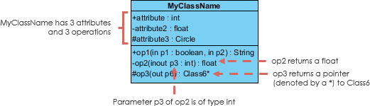
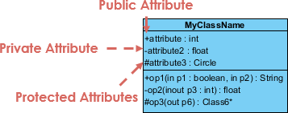
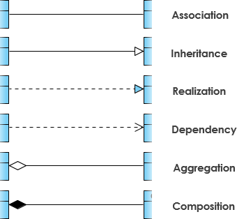
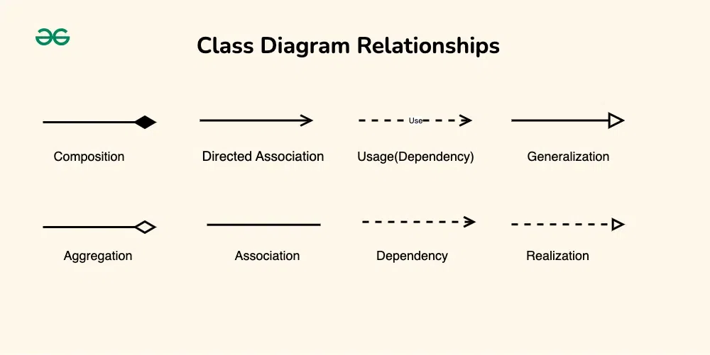

<!-- 
Blues/Greys: steelblue, royalblue, dodgerblue, slategray, darkslateblue.
Greens:      seagreen, forestgreen, olive, darkolivegreen.
Reds/Pinks:  crimson, indianred, firebrick, salmon.
Earth Tones: sienna, peru, chocolate, goldenrod. 
-->

:::{.callout}
It is difficult to create slide presentation for UML class diagram. For this reason, the live lecture will use this HTML file as a presentation mean.
::: 
# UML Class Notation

A class represents a concept which encapsulates **state** (attributes) and **behavior** (operations). Each attribute has a type. Each operation has a **signature**. The class name is the *only mandatory information*.


## Class Structure

A standard UML class is divided into three distinct partitions:

1. **Class Name:** The name of the class appears in the first partition.
2. **Attributes:** Shown in the second partition.
3. **Operations (Methods):** Shown in the third partition.

::: {#fig-class-comparison layout-ncol=2}
```{mermaid}
%%| fig-cap: "Class without signature"
classDiagram
    class Shape{
        -length
        +get_length()
        +get_length()
    }
```
```{mermaid}
%%| fig-cap: "Class with signature"
classDiagram
    class Shape{
        -length: int
        +get_length(): int
        +set_length(n: int) void
    }
```
:::


&#9998;&nbsp; [**Class Name**]{style="color:royalblue"}

- The name of the class appears in the first partition.

&#9998;&nbsp; [**Class Attributes**]{style="color:royalblue"}

- **Partitioning:** Attributes are listed in the second partition of the class box.
- **Typing:** The attribute type is shown after a colon (e.g., `-length : int`).
- **Implementation:** Attributes map directly onto **member variables** (data members) in source code.


&#9998;&nbsp; [**Class Operations (Methods)**]{style="color:royalblue"}

- **Partitioning:** Operations are shown in the third partition. They represent the services or behaviors the class provides.
- **Return Types:** The return type of a method is shown after a colon at the end of the method signature (e.g., `+get_length() : int`).
- **Parameters:** The return type of method parameters are shown after the colon following the parameter name (e.g., `+set_length(n : int) : void`).
* **Implementation:** Operations map onto **class methods** in source code.




**Summary Table: Notation Comparison**

| Feature | Without Signature | With Full Signature |
|:--- |:--- |:--- |
| **Attribute** | `-length` | `-length : int` |
| **Operation** | `+get_length()` | `+get_length() : int` |
| **Setter** | `+get_length()` | `+get_length(n : int) : void` |

## Class Visibility

The `+`, `-` and `#` symbols before an attribute and operation name in a class denote the visibility of the attribute and operation. 



- `+` denotes **public** attributes or operations
- `-` denotes **private** attributes or operations
- `#` denotes **protected** attributes or operations

## Parameter directionality

Each parameter in an operation (method) may be denoted as in, out or inout which specifies its direction with respect to the caller. This directionality is shown before the parameter name.


| Notation | Direction | Description | Equivalent Code|
|:----|:-----|:----------------------------------------|:-------------|
| `in` | input | The value is passed from the caller to the operation. The operation cannot modify the original value. This is the default if nothing is specified. | `void func(const int x)`
| `out` | output | The value is passed back from the operation to the caller. The initial value from the caller is ignored; the operation "fills" this variable. | `void function(int &x)` (used for returning multiple values)
| `inout` | Both | The value is passed to the operation, modified by it, and the new value is passed back to the caller. | `void func(int &x)` (where `x` has an initial value)


# Perspectives of Class Diagram

A diagram can be interpreted from various perspectives:

- [**Conceptual**]{style="color:brown"}: represents the concepts in the domain
- [**Specification**]{style="color:brown"}: focus is on the interfaces of Abstract Data Type (ADTs) in the software
- [**Implementation**]{style="color:brown"}: describes how classes will implement their interfaces


# Relationships between classes

UML is not just about pretty pictures. If used correctly, UML precisely conveys how code should be implemented from diagrams. If precisely interpreted, the implemented code will correctly reflect the intent of the designer.


[**What we have learned so far**]{style="color:royalblue"}

We have learned the following concepts:

- Inheritance
- Composition
- Aggregation
- Association
- Realization
- Dependiencies

These are the diagrams that you can find online:

<!-- {width="30%"}
{width="69%"} -->


Diagram using `mermaid` in Quarto. [Please see the code in the source file `chap_17.qmd`]{style="color:navy"}

```{mermaid}
classDiagram
direction BT
classA --|> classB : Inheritance
classC --* classD : Composition
classE --o classF : Aggregation
classG -- classH : Association
%% classI -- classJ : Link(Solid)
classK ..> classL : Dependency
classM ..|> classN : Realization
%% classO .. classP : Link(Dashed)
```

Below, we shall revisit these concepts but we go from weak to strong connections.

## Association

[**Association**]{style="color:royalblue"} is the most general relationship. It signifies a structural link between two peer classes. It can be uni-directional (one class knows about the other) or bi-directional (both know about each other).

- **Logic**: "Class A is associated with class B"
- **Visual**: A solid line. An arrow indicates the direction of the relationship. No arrow means bi-directional.
- **Example**: A `Teacher` and a `Student`. They are related, but one does not "own" the other.

```{mermaid}
classDiagram
    direction LR
    class Teacher
    class Student
    Teacher -- Student
```

## Aggregation ("Has-a")

[**Aggregation**]{style="color:royalblue"} is a specialized form of association that represents a "whole-part" relationship. However, it is "weak" — the parts can exist independently of the whole.

- **Logic**: "Class A has a Class B (but Class B can live without A)."
- **Visual**: A solid line with an empty diamond at the "whole" (parent) end.
- **Example**: A Library and a Book. If the library closes down, the books still exist.

```{mermaid}
classDiagram
    direction LR
    class Library
    class Book
    Library o-- Book
```

## Composition ("Part-of")

[**Composition**]{style="royalblue"} is a "strong" whole-part relationship. The part's lifecycle is strictly managed by the whole. If the whole is destroyed, the parts are destroyed too.

- **Logic**: "Class B is an integral part of Class A."
- **Visual**: A solid line with a filled diamond at the "whole" end.
- **Example**: A `House` and a `Room`. You cannot have a room that exists independently of a house; if the house is demolished, the room is gone.

```{mermaid}
classDiagram
    direction LR
    class House
    class Room
    House *-- Room
```

## Dependency ("Uses-a")

[**Dependency**]{style="royalblue"} is a weaker, often temporary relationship. It exists when one class uses another as a parameter in a method or a local variable. If the definition of the supplier class changes, the client class might need to change as well.

- **Logic**: "Class A uses Class B to perform a task."
- **Visual**: A dashed line with an open arrow.
- **Example**: A `Printer` class depends on a `Document` class to print. The printer doesn't "own" the document; it just needs it for a specific operation.

```{mermaid}
classDiagram
    direction LR
    class Printer
    class Document
    Printer --> Document: uses
```

## Inheritance (Generalization - "Is-a")

Inheritance is used when one class (the subclass or child) derives its attributes and methods from another class (the superclass or parent). It represents a specialized version of a more general concept.

- **Logic**: "Class B is a type of Class A."
- **Visual**: A solid line with a large hollow triangle pointing toward the parent class.
- **Example**: An `Ellipse` is a `Circle

```{mermaid}
classDiagram
    direction LR
    class Ellipse
    class Circle
    Ellipse <|-- Circle
```

## Realization (Implementation)

[**Realization**] is the relationship between an abstract class (or an interface) and the class that implements its behavior. The implementing class "realizes" the contract defined by the abstract class or the interface.

- **Logic**: "Class A implements the functionality defined by Interface B."
- **Visual**: A dashed line with a hollow triangle arrow pointing to the interface.
- **Example**: A `Tiger` class realizing a the abstract class `Animal` .

```{mermaid}
classDiagram
    direction LR
    class Tiger
    class Animal {
        <<abstract>>
    }
    Animal <|.. Tiger
```

## Regarding abstract class 

In UML, there are two primary ways to signify that a class is Abstract. Since abstract classes are designed to be inherited rather than instantiated, the visual notation needs to distinguish them from "concrete" classes.

- **The Standard Notation: Italics**

    The most common way to represent an abstract class is to write the class name in italics. If the class has abstract methods (methods with no implementation), those method names should also be italicized.

    **Visual**: _ClassName_

- **The Explicit Notation: Stereotype**

    If italics aren't clear enough (especially in hand-drawn diagrams), you can use a stereotype. You place the word "abstract" inside guillemets (« ») above the class name.

    **Visual**: «abstract»

    ```{mermaid}
    classDiagram
        direction LR
        class Car
        class Vehicle {
            <<abstract>>
        }
        Vehicle <|.. Car
    ```

:::{.callout-tip}
# How to note abstract class in paper exam
There are two ways to signify abstract class or interface in paper exam:

- We can write `*ClassName*` with the double asterisks surrouding the `ClassName`.
- We can write `<<abstract>>` above or below the `ClassName`.
:::

## Summary of relationship between classes

| Relationship | Human Logic | Programming Logic | Lifecycle Link | Visual Notation |
| :--- | :--- | :--- | :--- | :--------------- |
| **Association** | "Knows-a" | General | Independent | Solid Line (──) |
| **Aggregation** | "Has-a" | Whole-Part | Independent | Hollow Diamond (◇─) |
| **Composition** | "Part-of" | Whole-Part | Dependent | Filled Diamond (◆─) |
| **Dependency** | "Uses-a" | Temporary Use | Temporary | Dashed Arrow (- ->) |
| **Inheritance** | "Is-a" | Parent-Child | Parent-Child | Hollow Triangle (Solid Line) (─▷) |
| **Realization** | "Implements" | AbstractParent-Child | Contractual | Hollow Triangle (Dashed Line) (- -▷)|
    

# Cardinality

In UML, [**Cardinality**]{style="color:red"} (more formally known as [**Multiplicity**]{style="color:red./"}) defines the numerical relationship between two classes. It answers the question: "How many instances of Class A can be associated with one instance of Class B?"

## Common Cardinality Notations

| Notation | Meaning | Logical Description |
| :----- | :---------- | :--------------------------------- |
| **0..1** | Zero or one | Optional relationship (e.g., an Employee may have a Desk). |
| **1** | Exactly one | Mandatory relationship (e.g., a Car has exactly one Motor). |
| **0..*** | Zero or more | Optional collection (e.g., a Folder can contain zero or many Files). |
| **1..*** | One or more | Mandatory collection (e.g., a Team must have at least one Player). |
| ***** | Many | Short-hand for 0..* (e.g., a Member can join many Groups). |
| **n** | Specific number | Fixed quantity (e.g., a Tricycle has exactly 3 Wheels). |
| **m..n** | Numerical range | Bound quantity (e.g., a Jury has between 6 and 12 Members). |

## Cardinality: Examples

:::{.callout-note}
It is fine if you want to write data type in front of attributes (data members).
:::

&#10149;&nbsp; [**Example 1**]{style="color:crimson"}: A `Car` has $4$ `Tire`s and $1$ `Engine`:

```{mermaid}
classDiagram
    direction LR
    class Car {
        +String model
        +start_enginer()
    }
    class Tire {
        +int pressure
    }
    class Engine {
        +int horse_power
    }

    %% The filled diamond represents Composition (strong ownership)
    %% The numbers represent the Multiplicity/Cardinality
    Car "1" *-- "4" Tire : has
    Car "1" *-- "1" Engine : has
```

&#10149;&nbsp; [**Example 2**]{style="color:crimson"}: A `Library` can have many `Book`s and many `CD`s

```{mermaid}
classDiagram
    direction BT
    class Library {
        +String branchName
        +open()
    }
    class Book {
        +String isbn
        +String title
    }
    class CD {
        +String artist
        +int track_count
    }

    %% 'o--' represents Aggregation (hollow diamond)
    %% '*' or '0..*' represents "many"
    Library "1" o-- "0..*" Book : contains
    Library "1" o-- "0..*" CD : contains
```

&#10149;&nbsp; [**Example 3**]{style="color:crimson"}: One `Doctor` can have/examine many `Patient`s and one `Patient` can visit many `Doctor`s

```{mermaid}
classDiagram
    direction LR
    class Doctor {
        +String name
        +String specialization
        +schedule_appointment()
    }
    class Patient {
        +String name
        +Date dateOfBirth
        +view_medical_history()
    }

    %% The "*" on both ends signifies a Many-to-Many relationship
    Doctor "0..*" -- "0..*" Patient : treats
```

# Relationship between classes and Cardinality: Complex Examples

&#10149;&nbsp; [**Example 1**]{style="color:royalblue"} `Flight`, `Airport` and `Pilot` have the association relationships. 

- A `Pilot` "works" a `Flight`. It is a [relationship of service/interaction, not a structural "part-of" hierarchy.]{style="color:magenta"}
- An `Airport` can host multiple `Flight`s. One `Flight` can arrive at and depart from an `Airport`.

```{mermaid}
classDiagram
    class Flight {
        -String flight_number
        -DateTime depart_time
        +delay_flight(int minutes)
    }

    class Pilot {
        -String licenseNumber
        +String name
        +get_flight_hours() double
    }

    class Airport {
        -String iataCode
        +String city
        +get_weather() String
    }

    %% Association Relationships
    %% A flight has 2 pilots (Captain and Co-Pilot)
    Flight "0..*" -- "2" Pilot : assigned to
    
    %% A flight has exactly one departure and one arrival airport
    Flight "0..*" -- "1" Airport : departs from
    Flight "0..*" -- "1" Airport : arrives at
```

&#10149;&nbsp; [**Example 2**] Relationships between `Department`, `Lecturer`, `Student` and `Course`

1. A `Department` has many `Lecturer`s
2. A `Department` has many `Student`s
3. A `Department` offers many `Course`s
4. Multiple `Lecturer`s can teach one `Course`.
5. One `Lecturer` can teach multiple `Course`s.
6. One `Student` can take many `Course`s.
7. One `Course` can be enrolled by many `Student`s.

As you can see:
- The bullet points (1), (2) and (3) carry the idea of "part-of".
- The bullet points (4) and (5) carry the idea of "providing/using service".
- The bullet points (6) and (7) carry the idea of "offering/using the service".

:::{.callout-note}
Of course, we can use "has" for every sentence above in daily life. But since one `Student` rarely belongs to multiple `Department`s, the idea of "interaction between `Student` and `Department`" is not high. Students don't change from one department to another department frequenly (perhaps not at all during their entire study program). However, lecturers change courses during theit career quite frequently. For that reason, the frequency of interaction between them is quite high.
:::

```{mermaid}
classDiagram
    class Department {
        -String deptName
        +addLecturer(Lecturer l)
        +assignCourse(Course c)
    }

    class Lecturer {
        -String staffId
        +String name
        +getSpecialization() String
    }

    class Student {
        -String studentId
        +String gpa
    }

    class Course {
        -String courseId
        -int credits
    }

    %% Aggregation: Department is the "Whole"
    Department "1" o-- "1..*" Lecturer : employs
    Department "1" o-- "1..*" Student : manages
    Department "1" o-- "1..*" Course : offers

    %% Association: Functional relationships
    Lecturer "1..*" -- "1..*" Course : teaches
    Student "1..*" -- "1..*" Course : enrolled in
```

# Past paper exam

## Shapes

```{mermaid}
classDiagram
    class Shape {
        <<abstract>>
        +draw()* void
    }

    class Point {
        +float x
        +float y
    }

    class Polygon {
        %% -List~Point~ points
        +draw() void
    }

    class Rectangle {
        %% -Point bottom_left
        -float width
        -float height
        -float theta
        +draw() void
    }

    class Square {

    }

    class Ellipse {
        %% -Point center
        -float width
        -float height
        -float theta
        +draw() void
    }

    class Circle {
        
    }

    %% Inheritance (Generalization)
    Shape <|.. Polygon
    Shape <|.. Ellipse
    Polygon <|-- Rectangle
    Rectangle <|-- Square
    Ellipse <|-- Circle

    %% Composition and Multiplicity
    Polygon "1" *-- "3..*" Point : contains
    Rectangle "1" *-- "1" Point : bottom-left
    Ellipse "1" *-- "1" Point : center
```

- If you want, you can put `+draw(): void` again in `Square` and `Circle` but it is unnecessary. 
- However, you must put `+draw(): void` in `Polygon` and `Ellipse` because they implements the `+draw(): void` in the abstract base class.